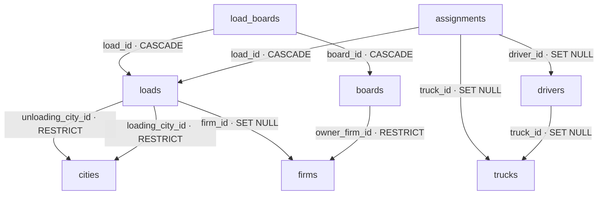

# Правила удаления связанных записей

Вся логика построена вокруг одного вопроса: **что происходит с «ребёнком», когда удаляют «родителя»?** В схеме используются три поведения.

## 🔴 CASCADE — ребёнок удаляется вместе с родителем

Ребёнок без родителя бессмысленен, хранить «сироту» незачем.

| Связь | Пример |
| --- | --- |
| `assignments.load_id → loads` | удалили груз — назначение «кто и на чём везёт» удаляется само |
| `load_boards.load_id → loads` | удалили груз — записи о его размещении на площадках удаляются |
| `load_boards.board_id → boards` | перестали работать с площадкой — связи грузов с ней удаляются |

## 🟢 SET NULL — ребёнок остаётся, ссылка обнуляется

Родителя может не стать, а историю нужно сохранить. Колонка при этом обязана быть nullable.

| Связь | Пример |
| --- | --- |
| `drivers.truck_id → trucks` | машину списали — водитель остаётся в базе без машины |
| `loads.firm_id → firms` | фирма ушла с рынка — история грузов сохраняется |
| `assignments.driver_id → drivers` | водитель уволился — запись «этот груз кто-то вёз» остаётся |
| `assignments.truck_id → trucks` | машину списали — аналогично |

## 🟡 RESTRICT — родителя не дадут удалить

Поведение по умолчанию (когда `ON DELETE` не указан). Родитель — обязательная опора: пока на него есть ссылки, `DELETE` завершится ошибкой, со ссылками нужно разобраться вручную.

| Связь | Пример |
| --- | --- |
| `boards.owner_firm_id → firms` | площадка без владельца не имеет смысла — сначала разберись с фирмой |
| `loads.loading_city_id → cities` | город — справочник, не удаляется, пока на него ссылаются грузы |
| `loads.unloading_city_id → cities` | аналогично |

## Схема

## Как запомнить

- **CASCADE** — удаляется вместе.
- **SET NULL** — остаётся, но теряет связь.
- **RESTRICT** — удалить не разрешат, пока есть ссылки.
